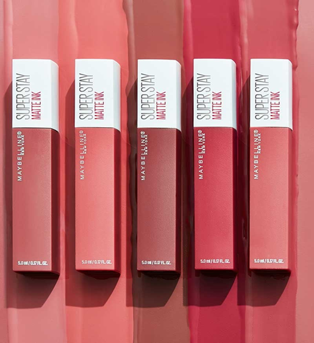

<h1 align="center">💄 Glamour & Brillo</h1>
<p align="center"><b>Tienda web de maquillaje y productos de belleza</b></p>
<p align="center">


</p>

<p align="center">
  
</p>

## ✨ Sobre el proyecto
**Glamour & Brillo** es una interfaz web enfocada en la presentación de productos de maquillaje y belleza. El proyecto trabaja la maquetación, organización visual de un catálogo y experiencia de navegación de una tienda.

## 🛍️ Contenido
- 💋 Catálogo de productos de maquillaje.
- ✨ Sección de productos destacados.
- 🏷️ Categorías, ofertas y novedades.
- 🔎 Barra de búsqueda.
- 🛒 Interfaz visual de carrito.
- 🚚 Información de envío y atención al cliente.
- 💄 Categorías como labiales, bases, correctores, sombras y accesorios.

## 🛠️ Tecnologías
**HTML5 · CSS3 · Font Awesome**

## 🚀 Visualización local
```bash
git clone https://github.com/AnniDiaz/Tienda-Maquillaje.git
cd Tienda-Maquillaje
```
Abre `index.html` en tu navegador.

## 📸 Vista del proyecto
<p align="center">
  
</p>

## 🎯 Objetivo
Aplicar fundamentos de desarrollo frontend y diseño web mediante una interfaz de e-commerce organizada, atractiva y orientada a la presentación de productos.

## 👩‍💻 Autora
**Elva Anni Díaz Regalado**  
[GitHub](https://github.com/AnniDiaz) · [LinkedIn](https://www.linkedin.com/in/elva-anni-diaz-regalado-168289307/)
